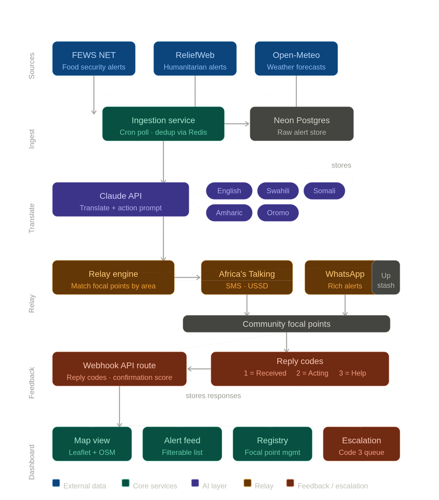

# Zindua
### General Overview
Community early warning relay for the IGAD region. Translates disaster alerts into actionable SMS in 5 languages using Claude AI, tracks focal point responses, and surfaces escalations to NGO coordinators in real time.

### System Architecture
